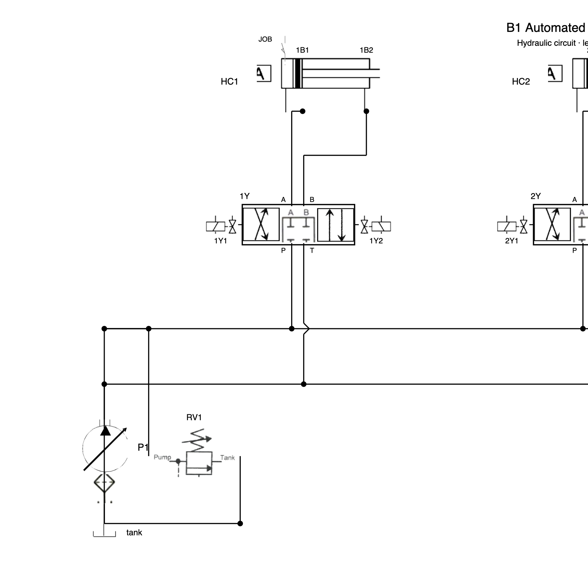
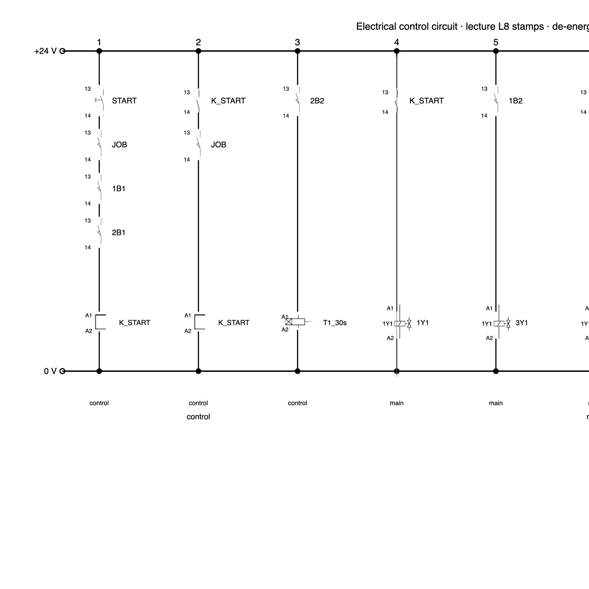
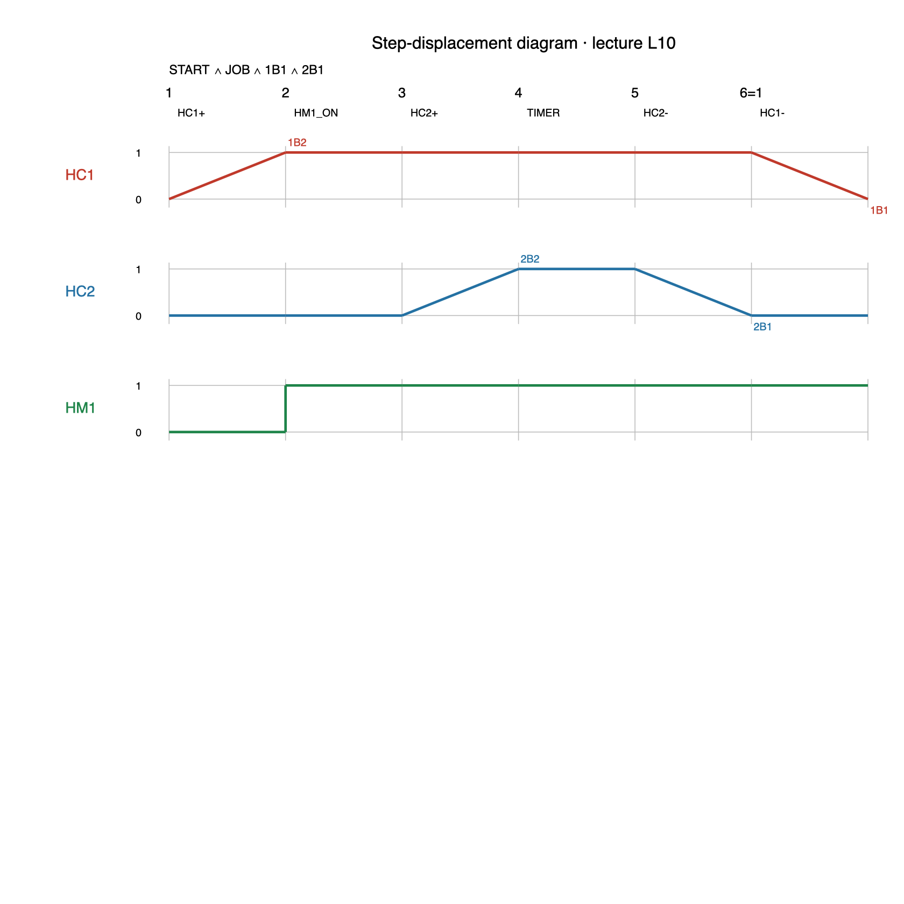
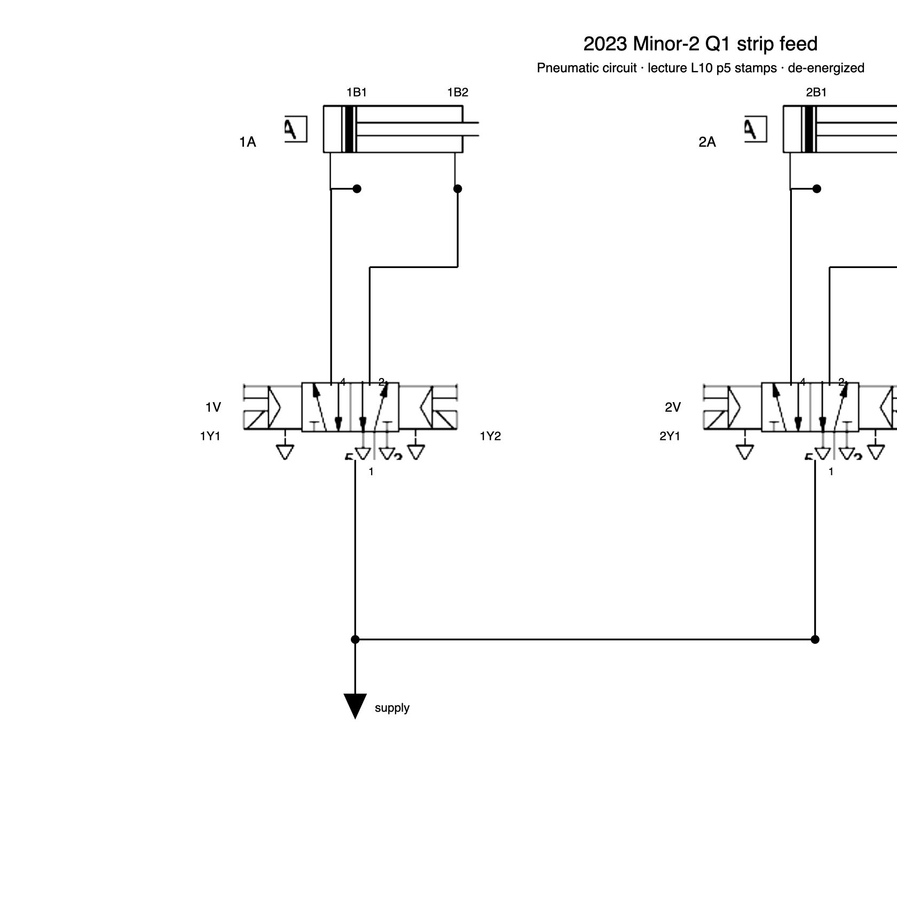

# MCL 431 CAM and Automation — circuit drawings (IIT Delhi)

Write a YAML spec. Python draws hydraulic, electropneumatic, and PYQ sheets the way this IIT Delhi course teaches them — lecture symbols, de-energized valves, L8 paths, L10 sequences.

## Contents

- [Gallery](#gallery)
- [Start in 3 commands](#start-in-3-commands)
- [What papers](#what-papers)
- [Handbook](#handbook)
- [Copyright](#copyright)

## Gallery

2023 Self-Study B1 grinding (HC1 / HC2 / HM1):







2023 Minor-2 Q1 strip feed (1A / 2A, 5/2):



## Start in 3 commands

Python 3.11+.

```bash
python -m venv .venv
source .venv/bin/activate   # Windows: .venv\Scripts\activate
pip install -e ".[dev]"
```

```bash
python -m circuit validate examples/grinding_machine/circuit.yaml
python -m circuit draw examples/grinding_machine/circuit.yaml
python -m circuit eval examples/grinding_machine/circuit.yaml
```

Open the sheets under `output/` after draw.

## What papers

- **Draw:** 2023 B1 grinding, 2017 hi-lo punch, 2023 Minor-2 strip feed
- **Calc only** (figure already on the paper): 2018 hi-lo, 2019 meter-in/out, 2016 hoist, 2023 B2 head loss, 2022 grind-given
- **Skipped:** PLC Minor-2 Q2; 2017 5/3 drill (no lecture crop)

Full gates: [docs/eval.md](docs/eval.md).

## Handbook

- [Solve a question](docs/solve-a-question.md)
- [What eval checks](docs/eval.md)
- [Copyright](docs/copyright.md)

Paper identifiers win (`HC1` vs `1A`). Hydraulic and electrical stay on separate sheets.

## Copyright

Code is MIT. Lecture decks and exam scans are not in this repo. Details: [docs/copyright.md](docs/copyright.md).
